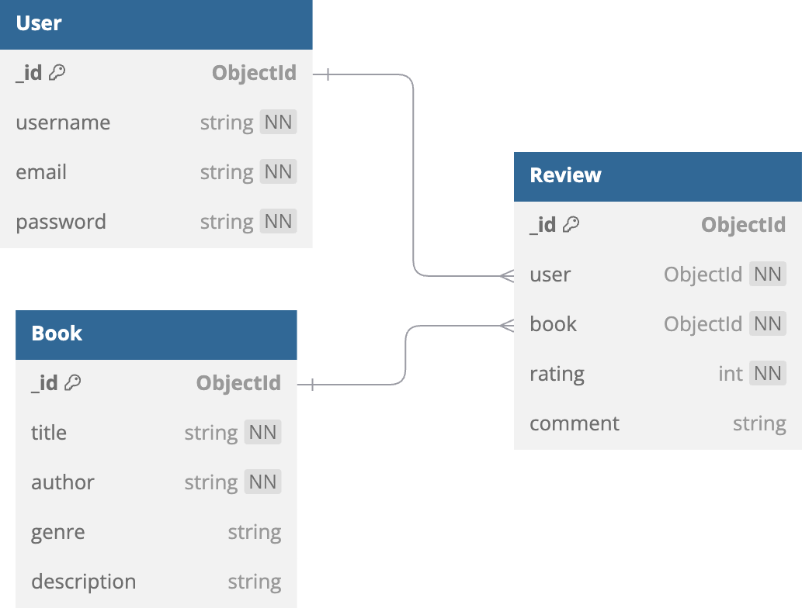

# Book Review API

A RESTful API for a Book Review system built with Node.js, Express, MongoDB, and JWT authentication.

## Features
- User signup and login (JWT-based authentication)
- Add, list, and search books (with pagination and filters)
- View book details with average rating and paginated reviews
- Submit, update, and delete reviews (one per user per book)

## Project Structure

- Modular code with controllers, models, routes, and middleware
- Uses environment variables (`.env`) for configuration
- Clear comments in source code for maintainability

## Tech Stack
- Node.js, Express.js
- MongoDB (Mongoose)
- JWT for authentication
- dotenv for environment variables

## Setup Instructions

1. **Clone the repository**
2. **Install dependencies**
   ```sh
   npm install
   ```
3. **Configure environment variables**
   - Copy `.env` and set your values for `PORT`, `MONGODB_URI`, and `JWT_SECRET`
4. **Run the server locally**
   ```sh
   npm run dev
   ```
   Or for production:
   ```sh
   node index.js
   ```

## Example API Requests

### Signup
```sh
curl -X POST http://localhost:5000/api/auth/signup -H 'Content-Type: application/json' -d '{"username":"user1","email":"user1@example.com","password":"pass123"}'
```

### Login
```sh
curl -X POST http://localhost:5000/api/auth/login -H 'Content-Type: application/json' -d '{"email":"user1@example.com","password":"pass123"}'
```

### Add Book (Authenticated)
```sh
curl -X POST http://localhost:5000/api/books -H 'Authorization: Bearer <TOKEN>' -H 'Content-Type: application/json' -d '{"title":"Book Title","author":"Author Name","genre":"Fiction","description":"A great book."}'
```

### Get All Books
```sh
curl http://localhost:5000/api/books?page=1&limit=10
```

### Get Book Details
```sh
curl http://localhost:5000/api/books/<BOOK_ID>
```

### Add Review (Authenticated)
```sh
curl -X POST http://localhost:5000/api/books/<BOOK_ID>/reviews -H 'Authorization: Bearer <TOKEN>' -H 'Content-Type: application/json' -d '{"rating":5,"comment":"Excellent!"}'
```

### Update Review (Authenticated)
```sh
curl -X PUT http://localhost:5000/api/reviews/<REVIEW_ID> -H 'Authorization: Bearer <TOKEN>' -H 'Content-Type: application/json' -d '{"rating":4,"comment":"Updated comment."}'
```

### Delete Review (Authenticated)
```sh
curl -X DELETE http://localhost:5000/api/reviews/<REVIEW_ID> -H 'Authorization: Bearer <TOKEN>'
```

### Search Books
```sh
curl http://localhost:5000/api/books/search?q=harry
```

## Notes on Authentication
- For all endpoints that require authentication, include the following HTTP header:
  - `Authorization: Bearer <TOKEN>`
- If you omit this header or provide an invalid token, you will receive a 401 Unauthorized error.

### Example: Unauthorized Access
```sh
curl -X POST http://localhost:5000/api/books -H 'Content-Type: application/json' -d '{"title":"Book Title","author":"Author Name"}'
```
**Response:**
```json
{
  "message": "No token, authorization denied"
}
```

## Example Error Responses

### Signup (Duplicate Email or Username)
```sh
curl -X POST http://localhost:5000/api/auth/signup -H 'Content-Type: application/json' -d '{"username":"user1","email":"user1@example.com","password":"pass123"}'
```
**Response:**
```json
{
  "message": "Username or email already exists"
}
```

### Login (Invalid Credentials)
```sh
curl -X POST http://localhost:5000/api/auth/login -H 'Content-Type: application/json' -d '{"email":"user1@example.com","password":"wrongpass"}'
```
**Response:**
```json
{
  "message": "Invalid credentials"
}
```

## Example .env File
```
PORT=5000
MONGODB_URI=mongodb://localhost:27017/bookreview
JWT_SECRET=your_jwt_secret_here
```

## Entity Relationship Diagram (ERD)

Below is a simple ER diagram for the Book Review API:



- A User can write many Reviews
- A Book can have many Reviews
- Each Review belongs to one User and one Book

## Database Schema

### User
- `username`: String (unique, required)
- `email`: String (unique, required)
- `password`: String (hashed, required)

### Book
- `title`: String (required)
- `author`: String (required)
- `genre`: String
- `description`: String

### Review
- `user`: ObjectId (ref User, required)
- `book`: ObjectId (ref Book, required)
- `rating`: Number (1-5, required)
- `comment`: String


## Troubleshooting
- If you encounter CORS issues, ensure your frontend is allowed in the CORS configuration (currently all origins are allowed by default).
- If you change the port, update the `PORT` variable in your `.env` file and use the correct port in your API requests.

## Design Decisions & Assumptions

- One review per user per book (enforced by unique index)
- JWT required for all review and book creation/modification endpoints
- Pagination defaults: 10 for books, 5 for reviews
- Error responses are standardized via middleware

---
